# Lawyer Recommendation Agent

The existing `/admin/lawyers` panel and `/api/lawyer-recommendations` endpoint now start a persistent, admin-approved recommendation workflow. Gemini understands the legal issue but never sees a tool for writing to the database and never selects a lawyer ID. The backend supplies real catalog and active lawyer snapshots to the internal Python service. Python ranks and validates those records; ASP.NET checks the returned IDs again against PostgreSQL.

```mermaid
flowchart LR
  A[Admin requirement] --> B[Gemini structured classification]
  B --> C[Validate category against database catalog]
  C --> D[Search real active lawyers and unbooked dates]
  D --> E[Deterministic ranking]
  E --> F[Validate IDs, category, status, date]
  F --> G[Persist recommendations and audit; await approval]
  G --> H[Admin selects recommended lawyer and real slot]
  H --> I[Revalidate and call existing AppointmentService]
  I --> J[Persist booking result and audit]
```



The Python LangGraph nodes are `parse_requirement`, `validate_category`, `retrieve_lawyers`, `rank_candidates`, `validate_recommendations`, and `await_human_approval`. An unsupported catalog match stops after validation. The backend persists the pause in `LawyerRecommendationWorkflows` (JSONB snapshots and timestamped audit events); approval resumes by workflow ID. The existing `AgentWorkflows` table belongs to service requests and is not changed. Practice Area and requested-date availability are hard eligibility gates. Recommendation Points equal recorded years of experience (0–70); tied candidates are ordered by stable lawyer ID. Points are not probabilities or measures of legal quality. Legacy `LawyerLegalService` links do not affect retrieval or ranking. The lawyer table has no location or verification field, so location is reported as unsupported and `Active` is the eligibility status. No legal advice is generated.

## Configuration and setup

The default model is `gemini-3.8-flash` in `ai-service/model_config.py`; `GEMINI_MODEL` overrides it. The lawyer agent uses the official `google-genai` SDK with Pydantic structured output. Other AI agents still use their existing LangChain integration.

### Demo dataset

To add synthetic data to the configured PostgreSQL database, run this command **deliberately** in Development. Normal API startup does not seed these records, and the command refuses to run in other environments. Check the configured connection string before running it, since this project may point Development at a shared Neon database.

```sh
ASPNETCORE_ENVIRONMENT=Development dotnet run --project backend/LegalService.API/LegalService.API.csproj -- --seed-demo-lawyers
```

The explicit demo seeder creates 30 synthetic lawyers (`lawyer01@example.test` through `lawyer30@example.test`, licenses `ILS/LAW/0001` through `ILS/LAW/0030`) distributed across existing catalog areas. With the current five-area catalog this is six lawyers per area. It creates no Practice Areas; Family Law is not part of the current supported catalog. Lawyer 30 is inactive. Existing Admin-managed lawyer and service data is preserved. Experience comes from the seed's recorded fields; location, ratings, success statistics, and verification flags are not invented.

The seeder creates `demo.customer@example.test` and development-only demo credentials through the existing password service. For the current five-area fixture, a fresh run adds 25 services, 87 availability windows, and 174 slots. Times vary between 09:00 and 12:00 UTC, and each active lawyer has recorded windows on three future dates (offsets are defined in `AvailabilityOffsets`). Repeated runs on the same date do not duplicate records. **This final review did not run the demo seed against the project database.**

For Member 1 approval, use the read-only `GET /api/lawyers/{id}/availability?date=YYYY-MM-DD` endpoint. The shared `/api/appointments/available-slots` endpoint can generate default slots and is deliberately not used by this module's approval UI.

For demos, try “I need a lawyer for a company contract dispute”, “I have a dispute about ownership of my land”, or “My employer terminated me and I need legal assistance”. Use an actual future date with seeded availability for date filtering. Recommendation eligibility uses Practice Area membership and requested-date availability; ranking uses recorded experience. It does not use direct lawyer-service links, profile text, or location.

Create `ai-service/.env` from `.env.example` and set `GEMINI_API_KEY`, `GEMINI_MODEL`, and `AI_INTERNAL_KEY` to private values. The AI service loads this Git-ignored file automatically at startup. Set `Ai__BaseUrl=http://127.0.0.1:8002/` and `Ai__InternalKey` to the same internal key in the backend process environment. The API key is used only by Python, never sent to browsers or mobile devices. Missing Gemini configuration and transient Gemini failures return 503. Invalid model categories return 422. Temporary Gemini errors are retried at most twice with short exponential backoff.

Apply the new EF Core migration to a database you are authorized to update before using the new endpoint:

```sh
EfDesignTime=true dotnet ef database update --project backend/LegalService.API/LegalService.API.csproj --startup-project backend/LegalService.API/LegalService.API.csproj
```

Review your target connection string first. This migration adds only `LawyerRecommendationWorkflows`; it does not change other members' entities. Apply it separately to each environment where this feature will run.

Run each process in a separate terminal from the repository root:

```sh
cd ai-service
python3 -m venv .venv
.venv/bin/python -m pip install -r requirements-member1.txt
.venv/bin/python -m uvicorn lawyer_recommendation.app:app --host 127.0.0.1 --port 8002
```

```sh
export Ai__BaseUrl=http://127.0.0.1:8002/
export Ai__InternalKey='YOUR_PRIVATE_INTERNAL_KEY'
ASPNETCORE_ENVIRONMENT=Development ASPNETCORE_URLS=http://127.0.0.1:5295 dotnet run --no-launch-profile --project backend/LegalService.API/LegalService.API.csproj
```

```sh
cd frontend
npm ci
VITE_API_URL=http://127.0.0.1:5295 npm run dev -- --host 127.0.0.1 --port 5173
```

```sh
cd mobile
flutter pub get
flutter run
```

Flutter uses its server-settings dialog to configure the backend URL. For a USB-connected Android device, run `adb reverse tcp:5295 tcp:5295` and set the app's backend URL to `http://localhost:5295`. On a simulator or device without USB forwarding, set it to an address reachable from the device.

## API and human approval

All recommendation endpoints require the existing Admin JWT. Workflows are readable or approvable only by the Admin who started them. The Python endpoint accepts only requests with the backend's `X-Internal-Key` and is not called by React or Flutter.

```http
POST /api/lawyer-recommendations
Authorization: Bearer <admin JWT>
Content-Type: application/json

{"requirement":"I need help with a synthetic property dispute in Jaffna","date":"2026-10-05","limit":3}
```

The existing `recommendations`, `warnings`, and `trace` fields remain; the response also contains `workflowId`, `status` (`AWAITING_APPROVAL`, `NO_MATCH`, `UNSUPPORTED`, or `ACTION_COMPLETED`), `parsedRequirement`, and `date`. Recommended lawyer profile summaries come from the backend database. An unsupported or no-match response has an empty recommendations array and a warning. Use `GET /api/lawyer-recommendations/{workflowId}` to resume or inspect the saved result and audit events. The Admin UI retains this ID in the URL and restores the workflow on refresh. Its stage tracker appears after the synchronous request finishes; no live stage progress is simulated.

```http
POST /api/lawyer-recommendations/{workflowId}/approve
Authorization: Bearer <same admin JWT>
Content-Type: application/json

{"lawyerId":"<ID from this workflow>","customerId":"<existing booking customer UUID>","slotId":"<unbooked slot UUID>"}
```

Approval rejects any ID outside the saved recommendation set. It rechecks active status, Practice Area membership, customer existence, slot ownership, requested date, and availability, then calls the existing `AppointmentService.BookAppointmentAsync`. On success the response status is `ACTION_COMPLETED` and includes `appointmentId`. The Admin UI searches existing Customer accounts through `GET /api/lawyer-recommendations/customers?search=...` and displays real unbooked slot options; no UUID entry is required. The recommendation flow does not create customers or slots itself. The existing integer `UserId` to UUID convention is validated by this recommendation approval path without changing the appointment schema or unrelated booking callers.

The React Admin AI Recommendation section shows verified interpretation, recorded AI/System/Human stages, ranked results, and human approval controls. The Flutter lawyer page exposes an Admin-only recommendation screen; both call the same backend API. Flutter does not contain AI logic.

## Test and demo

```sh
cd ai-service
.venv/bin/python -m unittest discover -s tests -p 'test_recommendation*.py' -v
cd ..
dotnet test backend/LegalService.Tests/LegalService.Tests.csproj --filter FullyQualifiedName~LawyerRecommendationApprovalTests
cd frontend && npm run build
```

For a synthetic demo, sign in as Admin, open **Lawyer & Legal Services → AI Recommendation**, enter “I need a lawyer for a synthetic property ownership dispute in Jaffna” and an optional date with an unbooked slot. Show the saved workflow, real Practice Area, ranked lawyers, and approval pause. Select a recommended lawyer, search for a Customer account, and choose a real slot to create the booking. Refresh the URL to show the same completed workflow. As a safe-failure demo, disconnect the Gemini service or unset `GEMINI_API_KEY`: the API returns a controlled error and no lawyer or booking is fabricated.

See [the final verification report](member1-final-verification.md) for inspected behavior, commands, live model evaluation, and remaining limitations.
